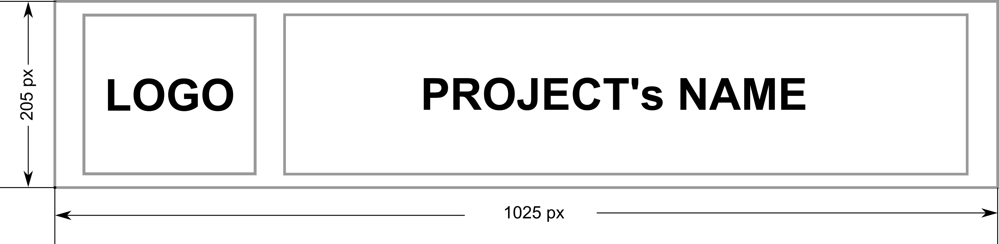





# {{ cookiecutter.project_name }}


[](https://github.com/{{ cookiecutter.github_organization }}/{{ cookiecutter.project_slug }}/actions/workflows/test.yaml)
[](https://codecov.io/gh/{{ cookiecutter.github_organization }}/{{ cookiecutter.project_slug }})

[](https://{{ cookiecutter.github_organization }}.github.io/{{ cookiecutter.project_slug }}/)

[](https://pypi.org/project/{{ cookiecutter.project_slug }}/)

[](https://github.com/pre-commit/pre-commit)
[](https://github.com/astral-sh/ruff)
 }}-blue)

## Description

{{ cookiecutter.readme }}

- [ ] TODO: replace this with a paragraph that says what the project does and who it is for.

## Installation

```bash
pip install {{ cookiecutter.project_slug }}
```

- [ ] TODO: keep this only once the project is on PyPI; until then point at the repository.

## Usage

- [ ] TODO: Add usage instructions for your project.

```python
import {{ cookiecutter.package_name }}

print({{ cookiecutter.package_name }}.__version__)
```

## Documentation

The full documentation is at
<https://{{ cookiecutter.github_organization }}.github.io/{{ cookiecutter.project_slug }}/>.
It is built with [Material for MkDocs](https://squidfunk.github.io/mkdocs-material/)
from the `docs/` directory:

```bash
mkdocs serve
```

## Documentation

See [docs/quickstart.md](docs/quickstart.md).

## Development

```bash
uv venv --python {{ cookiecutter.python_version }}
uv pip install -e '.[dev,tests,docs]'
pre-commit install
```

[ruff](https://docs.astral.sh/ruff/) is the only linter and formatter; it runs
on every commit through pre-commit. Tests are run with
[pytest](https://docs.pytest.org/):

```bash
pytest
```

## Contributing

Pull requests are welcome. For major changes, please open an
[issue]({{ cookiecutter.project_repo }}/issues) first to discuss what you would
like to change. The contribution guide is at
[docs/contributing.md](docs/contributing.md).

Please make sure to update tests as appropriate.

## License

{{ cookiecutter.license }} — see the [LICENSE](./LICENSE) file.
